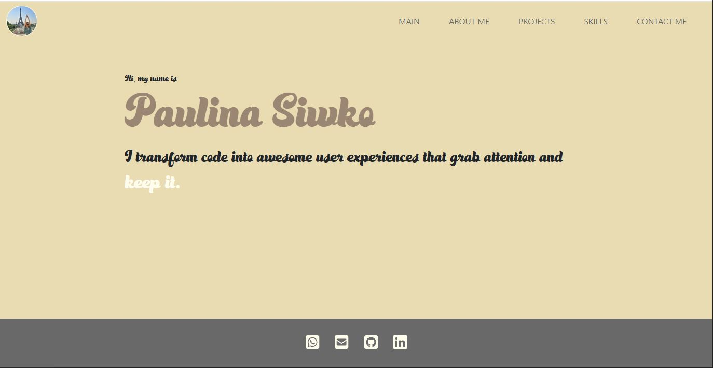

# React Portfolio

## Description
This project serves as my portfolio webpage, showcasing my various projects. 

The portfolio was created using **React** and **Bootstrap 5**. 

The primary purpose of this portfolio is to provide a centralized platform for displaying my projects, top skills and sharing my contact information. By maintaining this deployed webpage, I aim to present a comprehensive overview of my work and make it easy for others to connect with me.

## Installation
N/A

## Usage
After opening the code in the browser the resulting analysis looks as following:

The [URL](https://paulinasiwko.github.io/react-portfolio/) of deployed application.

## Technologies Used

- React
- Navigation using React Router
- Bootstrap
- HTML
- CSS
- JavaScript
- Font Awesome Icons

## Credits
- [CSS Text Animation Examples](https://www.sliderrevolution.com/resources/css-text-animation/)
- [Fonts](https://www.fontspace.com/)
- [Bootstrap cards idea](https://codepen.io/maryj25)
- [Portfolio inspiration](https://dorota1997.github.io/react-frontend-dev-portfolio/)
- [Portfolio inspiration](https://www.adhamdannaway.com/about)

## Licence 
N/A